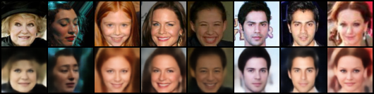
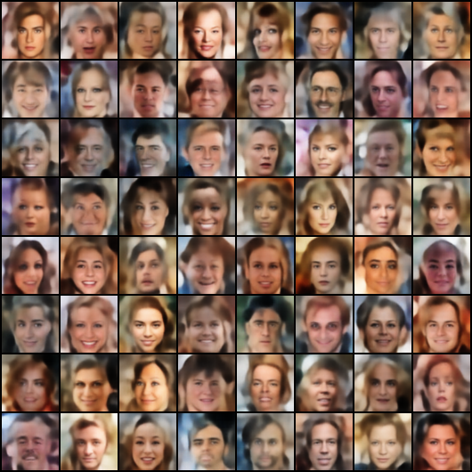

# Variational Auto Encoders (VAE)

Implements Variational Auto Encoder (VAE) [Kingma and Welling's ["Auto-Encoding Variational Bayes"](https://arxiv.org/pdf/1312.6114.pdf)] and associated training code for CelebA, plus the inference code for latent space sampling. You need to get the [CelebA](https://github.com/AntixK/PyTorch-VAE/#:~:text=to%20download%20the-,file,-from%20google%20drive) data separately and unzip under `./data/` due to download restrictions imposed by Google.

## How To Run:
Set up the environment (using miniconda)
```
$ conda create --name "vae" python=3.6.12
$ conda activate vae
$ pip install -r requirements.txt
```

## Running training: 
If you don't specify any flags, it trains for `batch=128` and `epochs=50`. During training, generated reconstruction and random sampled results are saved under `results/` folder. Also the model weights after each epoch is saved under `results.model/` folder.

```
$ python train_vae.py
```

Reconstruction of input pictures (top row: original, bottom row reconstructed) after 50 epochs.


Some 64 pictures generated by randomly sampled latent codes.



## Running the inference:
Interpolation results between two random CelebA pictures are saved as `rndpics_interpolate.{gif,png}`
```
python test_vae.py
```
Some examples of interpolation between two pictures by sampling from the latent space and generating images for each latent code

<table>
  <tr>
    <td>  </td>
  </tr>
  <tr>
    <td>  </td>
  </tr>

  <tr>
    <td>  </td>
  </tr>
  <tr>
    <td>  </td>
  </tr>

  <tr>
    <td>  </td>
  </tr>
  <tr>
    <td>  </td>
  </tr>
</table>  


### Notes on The Loss function (Training related):
In ["Kingma and Welling's paper"](https://arxiv.org/pdf/1312.6114.pdf), ELBO (Evidence Lower Bound) is the objective function to be maximized and given in Eqn (3) of the paper as follows:

$$\mathcal{L (\theta, \phi; x)}  =  \mathbb{E}_{z \sim q_{\phi(z|x)}}  [\log p_\theta (x|z)] - D_{KL}(q_\phi(z|x) || p_\theta(z))$$

<!--$$
\begin{align*}
\mathcal{L (\theta, \phi; x)} & =  \mathbb{E}_{z \sim q_{\phi(z|x)}}  [\log p_\theta (x|z)] - \mathbb{E}_{z \sim q_{\phi(z|x)}}  \Big[\frac{\log q_\phi(z|x)}{p_\theta(z)} \Big]\\
  & = \mathbb{E}_{z \sim q_{\phi(z|x)}}  [\log p_\theta (x|z)] - D_{KL}(q_\phi(z|x) || p_\theta(z))
\end{align*}$$
-->

The loss can be analytically calculated by assuming $p_\theta(.)$ is a normal distribution, $\mathcal{N}$.

1) **Reconstruction Loss (First Term) :** The distribution $p_\theta(x|z)$ represents the generator using a noisy observation model where $G_\theta(z)$ is the mean and $\eta I$ the variance of the normal distribution $\mathcal{N}(z;G(z),\eta I)$. Then, it is clear that the first term becomes the reconstruction error.

  $$ \log p_\theta (x|z) = -\frac{1}{2 \eta} ||x -G_\theta(z)||^2$$

2) **Regularization Loss, $D_{KL}$ :**  The analytical expression of $D_{KL}$ between two Normal distributions are given as:    $$ D_{KL} (\mathcal{N_1} || \mathcal{N_2})= \log \Big(\frac{\sigma_2}{\sigma_1}\Big) + \frac{\sigma_1^2 + (\mu_1 - \mu_2)^2}{2\sigma_2^2} - \frac{1}{2}$$
We can obtain the closed form expression for $D_{KL}(q_\phi(z|x) || p_\theta(z))$ in ELBO by assuming Normal distributions where $p_\theta(z)$ is from $\mathcal{N}(z;0,I)$ and estimated posterior $q_\phi(z|x)$ is from $\mathcal{N}(z;\mu,\sigma^2)$. Hence for $\sigma_2, \mu_2 =(1,0)$ and $\sigma_1, \mu_1 =(\sigma,\mu)$ the expression becomes:
        $$D_{KL}(q_\phi(z|x) || p_\theta(z)) = -\frac{1}{2} \big(1 +  \log (\sigma^2) -\mu^2 - \sigma^2\big)$$


Note that in the above equations, regularization loss (KL Divergence) is summed accross the latent dimension of vectors $\sigma, \mu$. Similarly, reconstruction loss is the sum of squared errors. Therefore the mean should have been calculated for the batch axis in the loss_function. But in practice I averaged over both batch and latent space dimensions.

```
    MSE = F.mse_loss(recon_x, x)
    KLD = -0.5 * torch.mean(1 + log_var - mu.pow(2) - log_var.exp())
    kld_weight = 0.00025  #0.025
    loss = MSE + kld_weight * KLD
```

Note that smaller ``kld_weight`` (0.00025) reduces the effect of regularization term (i.e. latent space is not strictly following a Normal distrubution and it is sparse) and causing sampling space to be more colorful (see above). But this helps the reconstructions to be closer to the originals (see above). For larger ``kld_weight`` (0.025), sampled images looks better (less colorful), but reconstructions becomes much different than the input.

### Code Reference:
   
   [1] Training code (train_vae.py) is mainly from Official Pytorch [examples/vae](https://github.com/pytorch/examples/tree/main/vae)

   [2] [AntixK github page](https://github.com/AntixK/PyTorch-VAE/) is a nice resource for various VAE algorithms. I mainly borrowed the code in `vae.py` from "class VanillaVAE" in `vanilla_vae.py`. Code is written very organized and modular by using pytorch-lightning that automatically uses DDP for multi-GPU training. However the modularity made it too complex to debug/understand for someone who is new. Besides there is no inference script for quick testing.
    

   [3] Got some inspiration from Moshe Sipper's [Medium post](https://medium.com/the-generator/a-basic-variational-autoencoder-in-pytorch-trained-on-the-celeba-dataset-f29c75316b26) and [github repo](https://github.com/moshesipper/vae-torch-celeba), for the inference code (test_vae.py)
 

   [4] Used some ideas/code about sampling from latent space, plotting them using matplotlib, generating GIF and using PCA. Tingsong Ou's [Medium Post](https://medium.com/@outerrencedl/variational-autoencoder-and-a-bit-kl-divergence-with-pytorch-ce04fd55d0d7) and [Alexander van de Kleut [github repo](https://avandekleut.github.io/vae/)